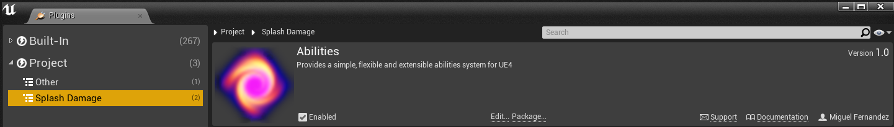
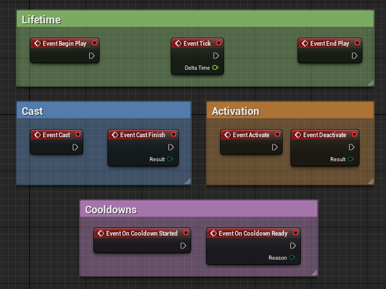
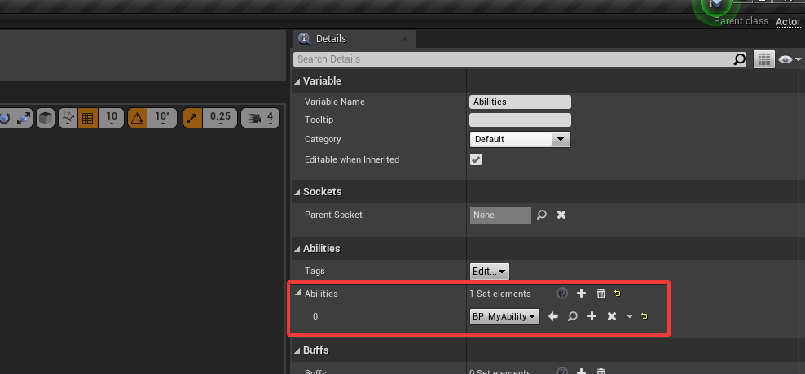
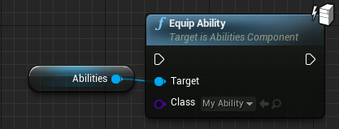
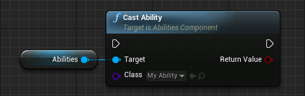

# Quick Start

Quick Start will show the basic steps to follow to setup the plugin and start using it at a base level.

## Previous Knowledge

This guide will let you decide between **Blueprints** and **C++**.

If you are new to UE4, consider reading through [Epic Games´s Quick Start](https://docs.unrealengine.com/en-US/Engine/QuickStart).

(Optional) If you are not familiar with C++ in UE4, it is recommended that you read through [Epic Games's introduction to programming](https://docs.unrealengine.com/en-US/Programming/Introduction).

## Setting up the Project

We can start by creating an empty project ([How to create UE4 projects](https://docs.unrealengine.com/en-US/Engine/Basics/Projects/Browser)) or instead using your own.

### Requirements

- Unreal Engine 4.25.1 or newer
- **SAS** requires [**Automatron**](https://github.com/splash-damage/automatron) to be installed for automated testing.

### Installing the plugin

Unreal Engine 4 (UE4) projects can contain plugins to extend the engine with new features. Since SAS is a plugin, follow this steps to install it into your project:

**1.** Download the last release from [here](https://github.com/splash-damage/abilities/releases)
?> NOTE: Install the plugin that matches your UE4 version

**2.** Extract the folder “Abilities” into the Plugins folder of your project (e.g "*MyProject/Plugins*")

**3.** Open the project

If everything went right, we should see the plugin enabled under *Edit->Plugins->Project->Splash Damage*



### Including Abilities in Build.cs (Only C++)

If you want to use SAS from C++ code, you will need to include it in your `YourModule.build.cs` file.

```c#
public class YourModule : ModuleRules
{
	public YourModule(ReadOnlyTargetRules Target) : base(Target)
	{
		PCHUsage = PCHUsageMode.UseExplicitOrSharedPCHs;
	
		PublicDependencyModuleNames.AddRange(new string[]
		{
			"Core",
			"CoreUObject",
			"Engine",
			"InputCore",
			"Abilities" //<-- Add 'Abilities' to use SAS
		});

		PrivateDependencyModuleNames.AddRange(new string[] {});
	}
}
```

## Adding an AbilitiesComponent to a pawn

The abilities component (UAbilitiesComponent) is the brain of the system. It will contain all abilities, buffs, cooldowns and tags of an specific player or AI.

<!-- tabs:start -->

#### **Blueprints**

Create a new pawn in blueprints from the content browser:


Open the new pawn and click on "Add Component" to select Abilities:


#### **C++**

Create a new pawn in C++. You can do this from the editor:


We will now open `MyPawn.h` and add some lines:

```cpp
#pragma once
#include <CoreMinimal.h>
#include <GameFramework/Pawn.h>

// First, include the component:
#include "AbilitiesComponent.h"
#include "MyPawn.generated.h"

UCLASS()
class MYPROJECT_API AMyPawn : public APawn
{
	GENERATED_BODY()
	
    // The component gets added as a class variable:
protected:
	UPROPERTY(VisibleAnywhere, BlueprintReadOnly, Category = Components)
	UAbilitiesComponent* AbilitiesComponent;
	
public:
	
	AMyPawn();
};
```

And `MyPawn.cpp`:

```cpp
#include "MyPawn.h"

AMyPawn::AMyPawn()
    : Super()
{
	// Create the component instance
	AbilitiesComponent = CreateDefaultSubobject<UAbilitiesComponent>(TEXT("Abilities"));
}
```


<!-- tabs:end -->

## Creating an Ability

Abilities follow the same flow you would use to create an actor. The developer creates the class (in Blueprints or C++), then this class gets instantiated in runtime.

<!-- tabs:start -->

#### **Blueprints**

Create a blueprint inheriting **UAbility** (or a child class of UAbility):


When you open the newly created blueprint you will see some events already showing up. However this is an overview of the most important ones:



?> **BeginPlay** is called when the ability is instantiated. In other words, when it is **Equipped**. The same happens with **EndPlay** and **Unequip**.

#### **C++**

Create a class inheriting **UAbility** (or a child class of UAbility):

```cpp
#pragma once

#include <CoreMinimal.h>
#include <Ability.h>
#include "MyAbility.generated.h"

UCLASS()
class MYPROJECT_API UMyAbility : public UAbility
{
	GENERATED_BODY()
};
```

<!-- tabs:end -->

## Equipping an Ability

When we equip an ability, we allow the player/AI to start activating it. All abilities that want to be activated must be equipped first.

The Abilities Component has a list of abilities that will be equipped at BeginPlay. If we go into our its details and look for *"Abilities"* we will be able to add an ability:



Abilities can also be equipped at any time calling *"EquipAbility"*:



?> NOTE: All equipped abilities get unequipped at **EndPlay**

## Activating an Ability

There are multiple ways to activate an ability. The simplest, is from the component:



It is not called Activate for a good reason! Abilities will decide if they have to cast before going into Activation. Some abilities have casting and others dont. Therefore if the ability has no cast, it will skip into activation.

For players, activation logic sometimes can get messy because of complex input logic. SAS has that problem solved, see [Player Input](quick-start/player-input.md).

?> For more details on abilities and their design, see the [Ability Section](resources/ability.md).

## Keep exploring

**UAbilitiesComponent** and **UAbility** have a long list of helpers and small functions that can come very handy at times. It is recommended to have a look through the functions to get at a glance a quick idea of what's there to play with.