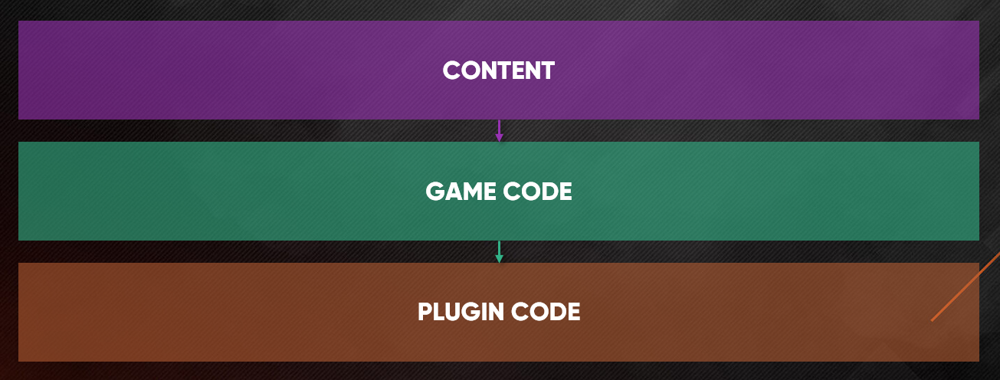

# Layered Development

**SAS** follows a simple development philosophy based on **layers** to allow for flexible content creation.

Following this philosophy or not is a decision for the developer himself to make. However this has proven beneficial in multiple scenarios and is the recommended way to go.

To do layered development we split our work in three different areas:

## Content Layer

The content layer represents all the abilities and buffs that, all together, constitute the game itself.

In many cases content doesn't require complex implementations and is easier and more productive to build it using **Blueprints**. This also opens the door to **non-coders**. It helps Designers, VFX, Animation, Audio and other professionals to build their own content directly from the editor.

## Game Code Layer

The **Game Code** layer implements **game specific features or mechanics**. It allows for custom fitting the ability system to an specific game and is used as the base used to create content.

Same as in the [content layer](#content-layer), SAS game code can be build in C++ or Blueprints.

Examples of game code could be: *" a base ability class that can only be activated is the owner is alive"* or *"a base abilities component that affects cooldowns"*

## Plugin Code Layer

The framework itself. Contains the base functionality of the plugin. All the features that are **not game or genre specific**.

Sometimes we, the developers, will require new features that didn't come with the plugin. This is entirely normal and expected! We can modify the plugin to our needs, but if these features are specific to the game, consider using the **[game layer](#game-code-layer)**.

Because of the nature of plugin code, it is easy to merge, reuse and obtain non-breaking updates for the game from other projects. Feel free to create new pull requests on [Github](https://github.com/splash-damage/abilities)!