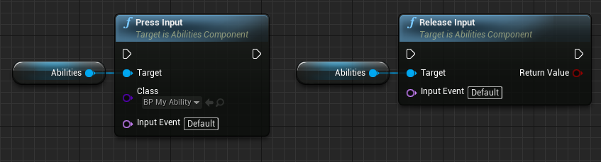

# Player Input

Abilities can simplify input logic to allow changing how casting or activation are triggered when an specific key is pressed or released. This called an **Input Profile**.

When input is received, it will be identified as an **Input Event**. This allows us to release the input later just with the event without needing to remember which ability was pressed:

## Input Profiles

SAS comes with some profiles implemented out of the box:

| Profile                    | On Press                | On Release              |
| -------------------------- | ----------------------- | ----------------------- |
| Cast while holding         | Cast                    | Activate                |
| Activate on press          | Activate                |                         |
| Activate while holding     | Activate                | Deactivate              |
| Toggle activation on press | Activate/Deactivate     |                         |
| Custom                     | Scripted on the ability | Scripted on the ability |

## Cancelling Inputs

Sometimes we want to "release" the input, but without triggering its effect from the Input Profile.
Cancelled Input must be scripted. By default it has no effect on the ability, the input will simply be marked as released.

## Use cases

Each ability can specify its own, individual, input profile.

Some games will use the same profile for all abilities, others will let the player decide using settings, and others will use different profiles for each ability. It is entirely up to the needs of the game.