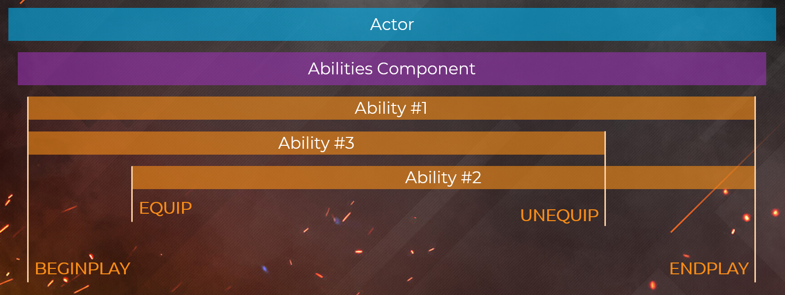
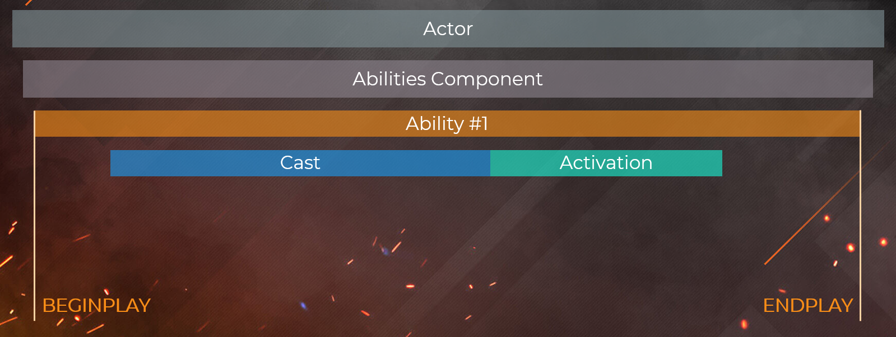
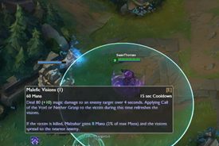
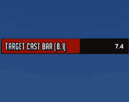

# Ability

## Lifetime

### Equipped Abilities

Abilities need to be equipped to be able to be used. This is when they create an instance that can run all their logic. Some abilities will be equipped at beginplay and others will remain until endplay.

It is important to not connect too much this concept to "equipping an ability" from a player point of view, since in some games this will be entirely hidden to the player.

?> Cooldowns are not afected by the lifetime of an ability and will keep cound even if unequipped. However if desired, cooldowns can be reset at endplay.

## States

Abilities have multiple states between which it can transition.

States can last any amount of time, but will stop if the ability is destroyed (unequipped).

### Cast

 

An optional state that indicates an ability is loading or waiting for player input to activate. Every game will have different casting or even none. 

Casting can cancel, but it can also succeed passing to activation.

### Activation

This somewhat self-explanatory state will start the action the ability executes:

*Firing, jumping, teleporting to X, resurrecting...*