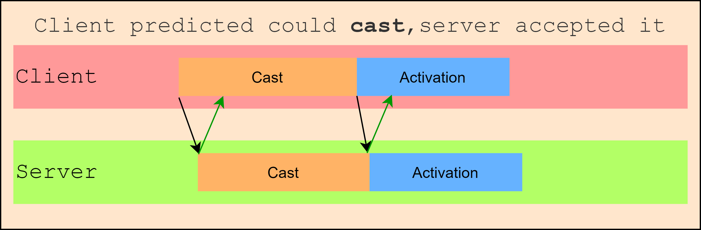
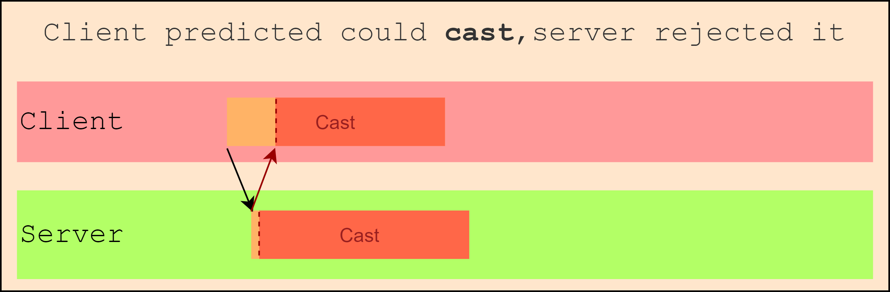

# Network Prediction

Abilities support network prediction.

**Prediction** allows players to see instantly the effects of their input without having to wait for the waytrip from the server. Abilities will simulate what would happen on the server and do it. However if the server later rejects the change, it will be reverted.

Lets be more visual with this!

In this case, cast and activation are predicted succesfully:

- Start instantly on client
- Start on server
- State change accepted, OK!

Sometimes however, the state change will be rejected on the server, notifying the client. Then the client will rollback, and in this case, stop casting. This can happen in scenarios with a lot of latency where the conditions on the server changed not allowing to cast. E.g: *A player lost health but this didnt arrive to clients on time.*